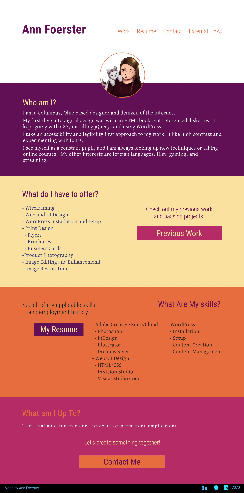

# foerfolio
I am redoing my portfolio after the last one was a rushed flop.  I'm posting screens in the Sources folder.  Colors are always changing.

Also going to add more scripting as I learn it.  Maybe check out Vue.

I have the page visible at https://annie4star.github.io/foerfolio/ if I remember to push it.

I'd love to hear feedback from anyone who stumbles across this project.
